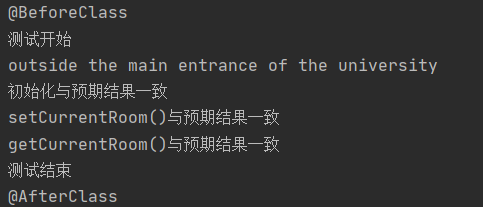

# 软件工程实践二
#### 1.任务分配
| 成员 | 任务 |
|----|:----:|
| 李成吉  | 后端逻辑开发 |
| 龚龙龙  | 前端页面开发 |
| 王茁园  | 单元测试 |
| 汪振宇  | 单元测试 |

#### 2.扩展功能
2.1 扩展游戏，使得一个房间里可以存放任意数量的物件，每个物件可以有一个描述和一个重量值，玩家进入一个房间后，可以通过“look”命令查看当前房间的信息以及房间内的所有物品信息；

2.2 在游戏中实现一个“back”命令，玩家输入该命令后会把玩家带回上一个房间；

2.3 在游戏中实现一个更高级的“back”命令，重复使用它就可以逐层回退几个房间，直到把玩家带回到游戏的起点；

2.4 在游戏中增加具有传输功能的房间，每当玩家进入这个房间，就会被随机地传输到另一个房间；

2.5 在游戏中新建一个独立的Player类用来表示玩家，玩家具有一定的承受重量上限，玩家可以拿去房间内的物品或丢弃自身的物品，房间内设置有饼干，吃掉饼干可以增加自己的承受重量上限

#### 3.UML
类图

用例图

#### 4.功能
###### 4.1房间内增加物品
```java
private ArrayList<Integer> weight = new ArrayList<>();
private int cookie;
```
###### 4.2增加玩家类
```java
public class Player {
    String name;//玩家姓名
    int maxWeight;//最大重量
    ArrayList<Integer> PlayerWeights = new ArrayList<>();//玩家携带物品

    public Player(String name,int maxWeight){
        this.name=name;
        this.maxWeight=maxWeight;
    }

    public void drop(Room room, int i){
        int w = PlayerWeights.remove(i);
        room.addWeight(w);
    }

    /**
     * 玩家拿去房间中的物品
     * @param room 房间
     * @param n 物品序号
     * @return 返回拿去结果
     */
    public boolean take(Room room,int n){
        int sum=0;
        for(int i=0;i<PlayerWeights.size();i++){
            sum+=PlayerWeights.get(i);
        }
        if(sum+room.getWeight().get(n)>maxWeight) return false;
        else{
            PlayerWeights.add(room.getWeight().get(n));
            room.removeWeight(n);
            return true;
        }
    }

    /**
     * 玩家吃掉房间内的魔法饼干
     * @param room
     */
    public void eatMagicCookie(Room room){
        maxWeight+=room.getCookie();
        room.removeCookie();
        room.setCookie(0);
    }

    /**
     * 求出玩家背包剩余量
     * @return
     */
    public int freeSpace(){
        int sum=0;
        for(int i=0;i<PlayerWeights.size();i++){
            sum+=PlayerWeights.get(i);
        }
        return maxWeight-sum;
    }
}
```
###### 4.3Back功能
```java
public class BackCommand extends Command {
    @Override
    /**
     * 执行返回操作
     */
    public boolean execute(Game game) {

        Room currentRoom = game.getCurrentRoom();
        LinkedList<String> directions = game.getDirections();
        if (directions.isEmpty()) {
            System.out.println("There is no door!");
        }
        else {
            String direction="";
            switch(directions.getFirst()){
                case "east":
                    direction="west";
                    break;
                case "west":
                    direction="east";
                    break;
                case "south":
                    direction="north";
                    break;
                case "north":
                    direction="south";
                    break;
                case "radom":
                    direction="radom";

            }
            Room nextRoom = game.getCurrentRoom().getExit(direction);
            game.removedirection();
            game.setCurrentRoom(nextRoom);
            System.out.println(nextRoom.getLongDescription());
        }
        return false;
    }
}
```
###### 4.4拿去和丢弃物品，增加饼干功能
```java
/**
     * 当前房间内的某个物品被玩家拿去
     * @param n 拿去物品编号
     * @return 拿去结果
     */
    public boolean take(int n){
        if(player.take(currentRoom,n)) return true;
        else return false;
    }

    /**
     * 玩家丢弃某个物品到当前房间
     * @param n 玩家物品编号
     */
    public void drop(int n){
        player.drop(currentRoom,n);
    }

    /**
     * 当前房间内的饼干被玩家所吃
     */
    public void eatCookie(){
        player.eatMagicCookie(currentRoom);
    }
```
###### 4.5随机房间
```java
Room random = new Room("in the random room");
random.setExit("north",theater);
theater.setExit("south",random);//随机房间的位置
```
#### 5.前端部分代码


####6.运行结果


#### 7.单元测试

对Game类中部分方法进行测试





#### 8.利用github平台的actions功能进行自动化检测和打包


